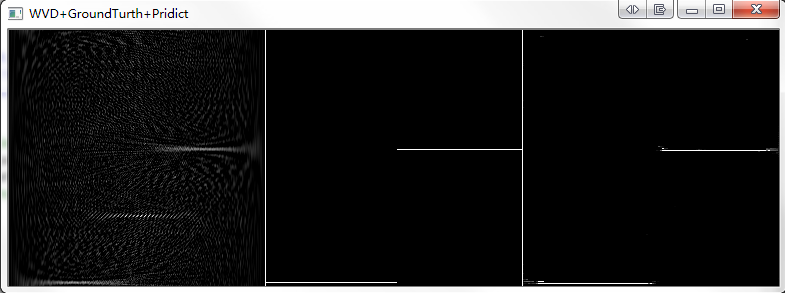

# IF Estimation via Unsupervised Learning
IF Estimation in TensorFlow

## Requirements

- [Windows or Linux]
- [Matlab]
- [Tensorflow (>= 1.0.0)](https://www.tensorflow.org/)
- [Numpy](https://github.com/numpy/numpy/blob/master/INSTALL.rst.txt)
- [OpenCV](https://docs.opencv.org/3.0-beta/doc/py_tutorials/py_tutorials.html)

## How-to

1. Run `Test_Signal_Gen.m` in Matlab and generate a non-stationary signal
2. Make sure of the parameter configuration of the signal and the signal path ('E:\TF_Test\' is default in windows)
3. Test the IF estimation by `Test.py` with three parameters `SignalType` `DataPath` and `ModlePath`
4. For example, `python E:\TF-Enhancement\Test.py 1 E:/TF_Test E:\TF-Enhancement\models\FH`

	SignalType: `1:FH, 2:LFM, 3:SFM`

## PS

The code of training will open source as soon as possible# TF-Enhancement
